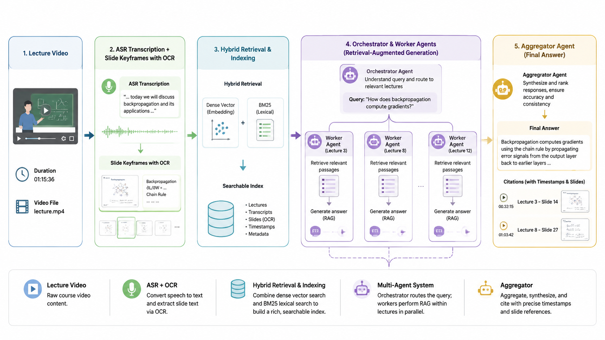

# CanvasClaw 🎓 — 多智能体课程问答助手

A **LangGraph Orchestrator–Worker multi-agent** assistant that answers natural-language
questions over a **whole semester of lecture videos** — with **lecture-grained routing**,
parallel per-lecture RAG, and **timestamp/slide-grounded citations** (one-click jump to the
exact moment in the video). Validated on a real 26-lecture course (~23 h).



## Architecture (maps 1:1 to the 调研报告)

```
student question
   │  Feishu bot  /  Streamlit                       ← frontend (报告 §6)
   ▼
retrieve_candidates → select_lectures(router LLM, 1–N) → dispatch(fan-out)
   → worker × N (RAG within one lecture unit, cited) → aggregate(merge + stream)
   └──────────────────────  LangGraph  (报告 §4–5, Fig.1)  ──────────────────────┘
```

| Design decision (report) | Here |
|---|---|
| Orchestrator–Worker (报告 §4.2) | `engine/graph.py` nodes + `Send` fan-out |
| LangGraph + State Reducer (§5) | `GraphState.worker_outputs` additive reducer |
| LLM = any OpenAI-compatible endpoint, runtime-switchable (§5) | `engine/llm.py` + `config/.env`; in-UI model selector |
| ASR Whisper large-v3 + word ts (§2) | `scripts/transcribe.py` (faster-whisper, GPU; `ASR_LANG=zh`, `condition_on_previous_text=False`) |
| 2-stage question detection (§2.3) | regex stage in `transcribe.py`; LLM stage in worker |
| PPT parse + VLM fallback (§3) | `engine/slides_ocr.py` (perceptual-hash keyframes + vision OCR) |
| PPT↔video alignment {slide_index,start,end} (§3.2) | `engine/segment.py` + `slides/slides.json` |
| Feishu bot, cards, sessions (§6) | `frontend/feishu_bot.py` (lark-cli events + interactive card) |
| **Scoped retrieval + faithful “no answer”** | `engine/index.py` scope filter → honest abstain + “search full range” button |
| **Live multi-agent status blocks** (grey→green) | `engine/agent.py` incremental `dispatch`/`worker` stream events |

## Layout
```
config/config.py      central settings (reads config/.env)
engine/schemas.py     locked data contract
engine/llm.py         OpenAI-compatible chat/vision + local bge embeddings
engine/segment.py     transcript+slides → time-balanced lecture units + chunks
engine/slides_ocr.py  vision OCR per slide → titles + slide chunks
engine/index.py       hybrid (bge + BM25) retrieval; unit routing + chunk search
engine/graph.py       LangGraph Orchestrator-Worker
engine/agent.py       CanvasClaw.answer(q, scope=…) / .stream()   ← public API
frontend/streamlit_app.py   chat UI: model selector + scope + agent-status blocks + jump-to-timestamp
frontend/feishu_bot.py      Feishu bot (interactive cards, multi-turn)
scripts/ingest_all.sh       parallel multi-GPU ingest of a whole semester (ASR→slides→segment→index)
tools/                eval (ask_batch, gen_questions), ablation (ablation_metrics, run_settings_ablation,
                      scope_eval), media (capture_ui, mc_render, make_video)
cli.py                quick CLI test
data/lectures/<id>/   transcript.json · slides/ · units.json · meta.json   (+ data/index/ = global index)
```

## Setup
1. `pip install -r requirements.txt` — install the right **torch** build for your platform first;
   `torchvision` is required (transformers lazily imports it under Streamlit).
2. Configure the LLM endpoint: copy `config/.env.example` → `config/.env` (any OpenAI-compatible API).
3. Ingest a semester: list videos in `data/videos.csv` (`lecture_id|video|title|week`), then
   ```
   ASR_LANG=zh MAXPAR=4 bash scripts/ingest_all.sh        # ASR + slides + segmentation + global index
   python tools/enrich_titles.py && python tools/ocr_all.py && python -m engine.index   # optional: titles + slide OCR
   ```
   (faster-whisper is **CUDA-only** — ingest on a GPU box; serve anywhere.)
4. Use it:
   ```
   python cli.py --stream "老师在哪节课讲了检索增强？"
   streamlit run frontend/streamlit_app.py --server.fileWatcherType none   # web demo
   python frontend/feishu_bot.py                                            # Feishu bot
   ```

## Full-semester evaluation & ablation

Validated end-to-end on a **full 26-lecture semester** (~23 h; 19 lectures with usable audio, 7 source-broken). 48-question battery (factual / locate / compare / out-of-scope) scored by a **244-agent adversarial LLM judge**.

**Foundation-model ablation** (identical battery, same retrieval/prompts, swap only the LLM):

| Model | Correct (judged) | Faithful | Quality | Routing | Grounding | Latency |
|---|---|---|---|---|---|---|
| **qwen3.6-plus** ⭐ | 56% | 4.23 | 3.90 | 44/48 | 97% | 160 s |
| deepseek-v4-flash | 48% | 3.71 | 3.54 | 40/48 | 83% | 35 s |
| gpt-5.5 | 40% | 3.92 | 3.15 | 40/48 | 100% | 35 s |

**Settings ablation:** hybrid retrieval (α=0.5) routing **71%** vs vector-only 55% vs BM25-only 68%; cross-lecture fan-out is critical (fanout=1 → routing 50%); top-k 3/6/12 barely matters.

**Scope / faithful-none** (`tools/scope_eval.py`): under a limited scope, citations **never leak outside it (10/10)**, in-scope queries answer (10/10), and out-of-domain questions are honestly **abstained (4/4)** — with a one-click full-range fallback (10/10 recovery).

Extras: runtime **model selector** (auto-detects `/v1/models`), **scope-restricted Q&A** with faithful abstention, **live multi-agent status blocks**, and an auto-generated **~1-min explainer video** (screen recording + Motion Canvas animation, see `video/`). Full report + methodology in `reports/`.

## Status
- ✅ Multi-lecture pipeline (ASR → slides → OCR → hybrid index), Orchestrator–Worker RAG, timestamp/slide-cited answers — verified on a full semester.
- ✅ Streamlit UI (model selector, agent-status blocks, jump-to-timestamp) + Feishu bot.
- ▶️ Quickstart: `pip install -r requirements.txt`, copy `config/.env.example` → `config/.env`, ingest videos (`scripts/ingest_all.sh`), then `streamlit run frontend/streamlit_app.py`.
